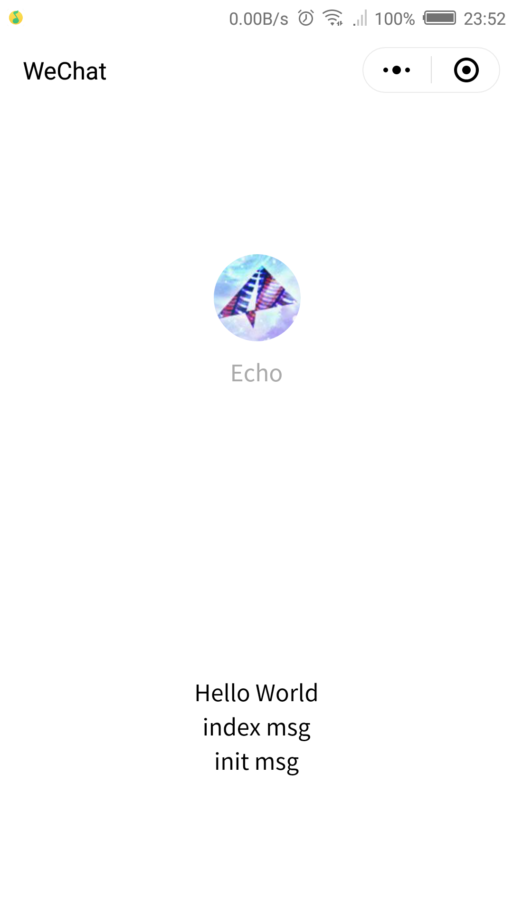

# 小程序 mixin 选项合并

### 微信开发工具导入项目

```console
  新建项目 -> 导入src文件 -> 预览效果
```

### 代码

> mixin.js

```js
  const nativePage = Page
  Page = options => {
    const mixins = options.mixins
    if (Array.isArray(mixins)) {
      Reflect.deleteProperty(options, 'mixins')
      merge(mixins, options)
    }
    nativePage(options)
  }

  // 原生Page属性
  const properties = ['data', 'onLoad', 'onReady', 'onShow', 'onHide', 'onUnload', 'onPullDownRefresh', 'onReachBottom', 'onShareAppMessage', 'onPageScroll', 'onTabItemTap']

  // 合并mixins属性到Page的options中
  function merge(mixins, options) {
    mixins.reverse().forEach(mixin => {
      if (Object.prototype.toString.call(mixin).slice(8, -1) === 'Object') {
        for (let [key, value] of Object.entries(mixin)) {
          if (key === 'data') {
            options.data = Object.assign({}, value, options.data)
          } else if (properties.includes(key)) {
            let native = options[key]
            options[key] = function (...args) {
              value.call(this, ...args)
              return native && native.call(this, ...args)
            }
          } else {
            options = Object.assign({}, mixin, options)
          }
        }
      }
    })
  }
```

### 使用

> 在 app.js 中引入 mixin.js 文件

```js
  require('./vendor/mixin.js')
```

> mixins/index.js

```js
  module.exports = {
    data: {
      indexMsg: 'index msg' 
    }
  }
```

> mixins/init.js

```js
  module.exports = {
    data: {
      initMsg: 'init msg'
    }
  }
```

> 在 index 页面的 index.js 中使用

```js
  Page({
    mixins: [require('../../mixins/index.js'), require('../../mixins/init.js')],
    data: {
      motto: 'Hello World',
      userInfo: {},
      hasUserInfo: false,
      canIUse: wx.canIUse('button.open-type.getUserInfo')
    }
  })
```

### 截图预览

> mixin使用前后对比

<div align=center>
  
  
</div>

### 原理说明

* 模仿vue中的mixin功能
* 避免使用 Page(Object.assign({}, require('../../mixins/index.js'), {data: {}})) 结构直接覆盖
* data数据结构浅复制
* Page原生结构属性顺序执行
* 其他自定义结构属性直接覆盖

### 如果觉得不错，请动动您的小拇指，star一下
